##Explorateur de ficher realiser avec l'interface tkinter
## Membre du groupe
##KOUDOKODJI FADEL
##SOGADJI CALEB
##YALO EMILE
##KODOKO DELVARIS
##MIGNANWANDE Joris
##Ce projet est un explorateur de ficher qui permet d'ouvrir ,modifier ,ajouter des dossiers ou fichers comme favoris....etc sur un pc

##capture de chaque fonctionnalité
##1 et 9 Interface Graphique  et interface visuelle
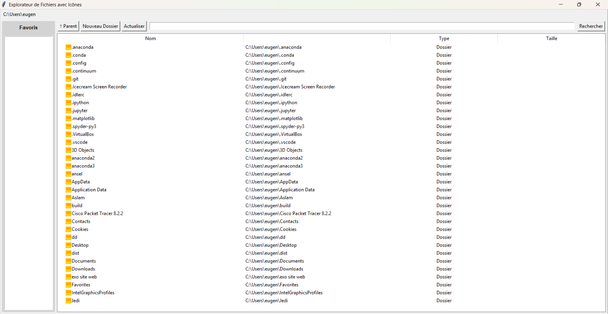

##2-Barre de chemin
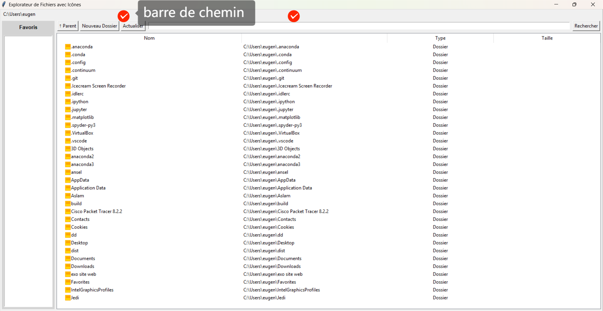

##3-Affichage des Fichiers et Dossiers
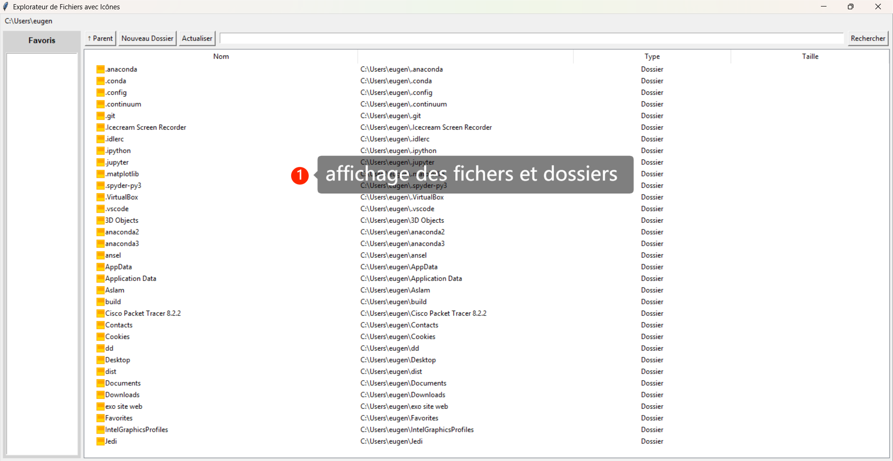

##4-Navigation
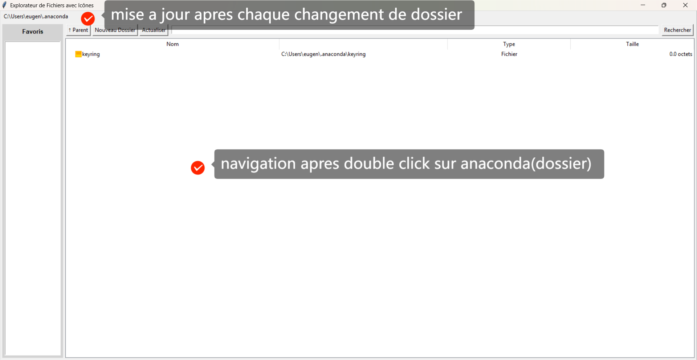

##5-Options Contextuelles
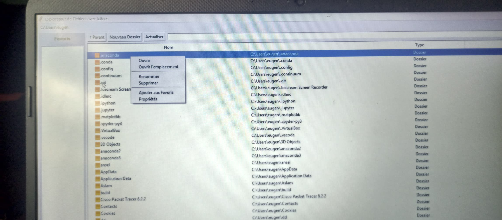

##6- Création de Nouveaux Dossiers voici la boite qui s'ouvre apres click sur le boutton nouveau dossier 
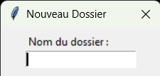

##8-button actualiser
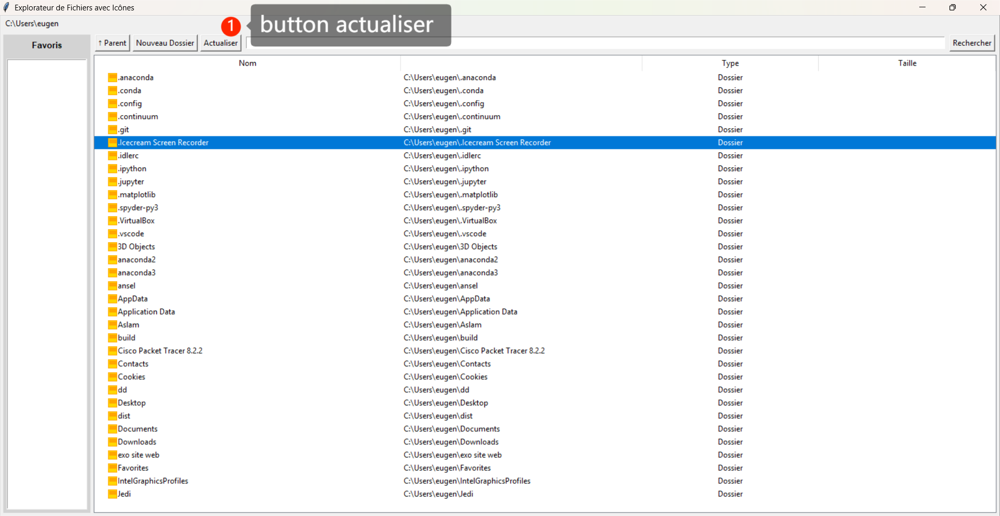

##10-affichage dossier ou ficher favoris
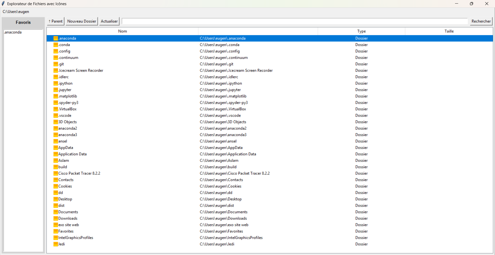

##11- fonctionnalite de recherche
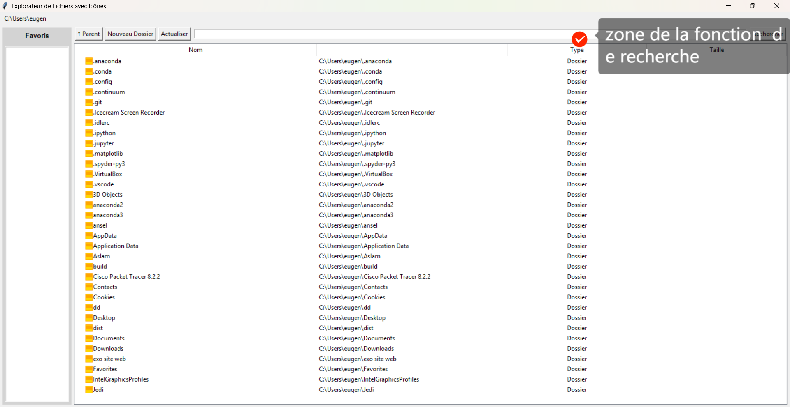

##12-Ajoutez des informations sur les fichiers sélectionnés taille, dates...etc
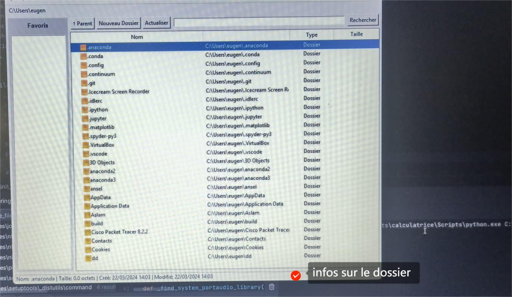

##13-Gestion d'erreur
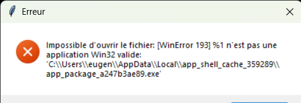

